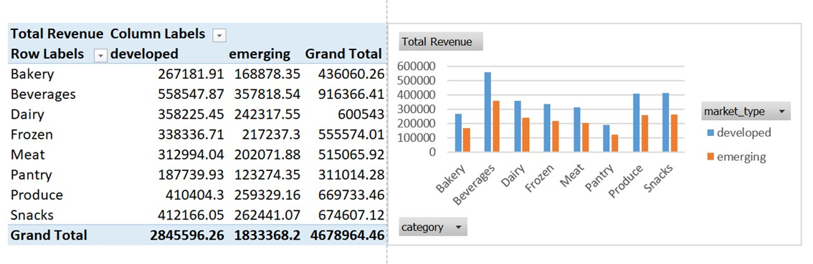
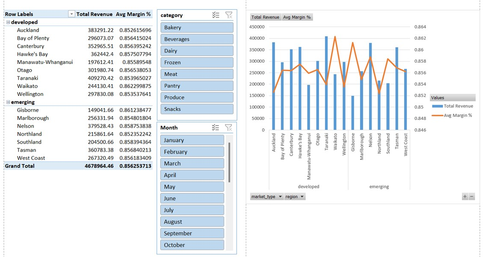
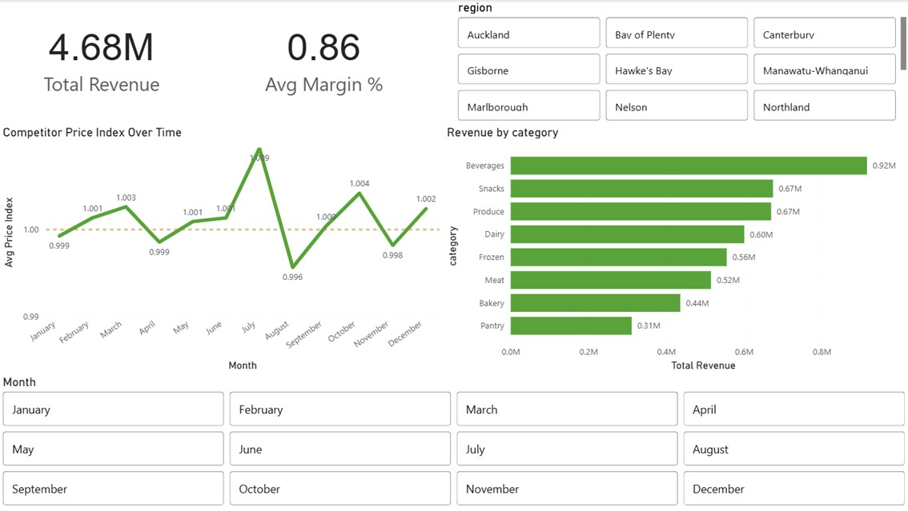

# Pricing Analytics Pipeline — Excel, Power Query & Power BI

Power Query transformation pipeline and Power BI dashboard for pricing 
analytics, built on simulated data with realistic data quality issues.

## Project overview

A end-to-end pricing analytics project built on simulated New Zealand business retail data. The pipeline starts with raw corrupted CSVs, cleans them through Power Query with full audit logging, and delivers a star schema data model and Power BI dashboard covering revenue, margin, competitor pricing, and regional performance.

---

## Screenshots

### Pivot tables — total revenue by market type


### Pivot tables — margin and revenue analysis


### Power BI pricing dashboard


---

## Project structure
```
pricing_analytics-excel/
├── data/
│   ├── raw/                   # Corrupted CSV inputs (pipeline entry point)
│   └── clean/                 # Clean reference outputs
├── excel/                    
│   └── powerquery/            # Power Query pipeline
│   └── pricing_dashboard.xlsx # Excel data model          
├── powerBI/                   # Power BI dashboard (.pbix)
├── python/
│   ├── generators/            # Data generation scripts
│   ├── utils/                 # Corruption and helper functions
│   ├── config.py              # Shared configuration
│   └── generate_data.py       # Main entry point
├── screenshots/               # Dashboard and pipeline screenshots
└── requirements.txt
```
## Data quality issues handled

The raw CSVs are generated with the following deliberate corruptions to 
simulate real-world messy data:

- **Mixed types** — numeric columns partially converted to strings
- **Injected text noise** — values like "N/A", "unknown", "error" in numeric fields
- **Invalid dates** — mixed formats and impossible dates (e.g. 2024/99/99)
- **Invalid foreign keys** — ~2–3% of FK values referencing non-existent records
- **Outliers** — units sold inflated by 10–100x on a small fraction of rows
- **Negative values** — profit and price columns with flipped signs
- **Duplicate rows** — ~2–5% of transactions duplicated to simulate ingestion issues
- **Out-of-range discounts** — discount percentages between 150% and 500%

---

## Pipeline summary

### Power Query transformation steps
1. **Reference tables** — `dim_regions`, `dim_products`, `dim_customers` cleaned first
2. **Helper function** — `fn_clean_numeric` built once, applied across all numeric columns
3. **Fact tables** — `fact_sales` and `fact_competitors` cleaned with full audit logging
4. **Audit tables** — every rejected row captured with a labelled rejection reason
5. **Analytical model** — fact tables joined to dims, analytical columns added

### Data model (star schema)
- `fact_sales` → `dim_products`, `dim_customers`, `dim_regions`, `dim_date`
- `fact_competitors` → `dim_products`

### Power BI dashboard
- KPI cards and revenue trend
- Revenue and margin by category and region
- Competitor price index analysis

---
## Setup
1. Create a virtual environment: `python -m venv venv`
2. Install dependencies: `pip install -r requirements.txt`
3. Generate data: `python python/generate_data.py`
4. Open `excel/` workbook and refresh Power Query
